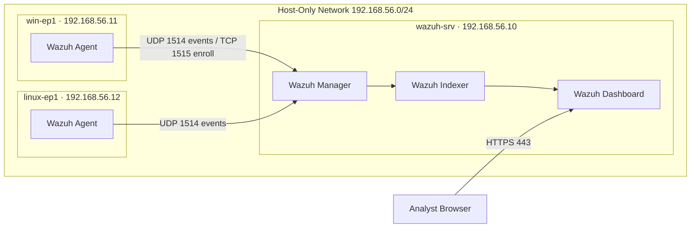

# Wazuh SOC Lab — Detection Engineering with MITRE ATT&CK

> A home Security Operations Center built on Wazuh, with Sysmon telemetry across Windows and Linux endpoints and custom detection rules mapped to MITRE ATT&CK. Built and documented in public, one phase at a time — see **Project Status** for what's live today.

## Architecture



Three virtual machines on an isolated VirtualBox host-only network (`192.168.56.0/24`):

- **`wazuh-srv`** (192.168.56.10) — Ubuntu Server 26.04 LTS, running the Wazuh 4.14.5 stack (Manager, Indexer, Dashboard) in Docker
- **`win-ep1`** (192.168.56.11) — Windows 11 Enterprise Evaluation endpoint with the Wazuh agent
- **`linux-ep1`** (192.168.56.12) — Ubuntu Server 26.04 LTS endpoint with the Wazuh agent

## Project Status

This lab is built in stages, with a commit and a writeup at each milestone.

- [x] **Phase 1 — Lab live.** Wazuh SIEM deployed via Docker Compose; Windows and Linux endpoints both enrolled and reporting as Active. Detection pipeline validated end to end: an SSH brute-force test against the Linux endpoint produced **18 authentication-failure alerts**, which Wazuh automatically mapped to **MITRE ATT&CK T1110 (Brute Force)** and **T1110.001 (Password Guessing)**.
- [ ] **Phase 2 — Sysmon telemetry** (Olaf Hartong modular config) on the Windows endpoint
- [ ] **Phase 3 — 12 custom detection rules** mapped to MITRE ATT&CK across execution, persistence, privilege escalation, defense evasion, credential access, discovery, and C2
- [ ] **Phase 4 — 6 AI/agent threat detections** mapped to MITRE ATLAS and the OWASP Agentic Top 10 (shadow AI, LLM data exfiltration, MCP/agent activity)
- [ ] **Phase 5 — Rule validation** with Atomic Red Team
- [ ] **Phase 6 — Local LLM alert triage** (Ollama + Mistral), keeping all telemetry on-device
- [ ] **Phase 7 — Architecture diagram + full writeup**

## Stack

- **Wazuh 4.14.5** — SIEM, deployed as a 3-container Docker stack (Manager, Indexer, Dashboard)
- **Docker Compose** — Wazuh stack orchestration
- **VirtualBox** — isolated host-only lab network
- *Coming in later phases:* Sysmon (Olaf Hartong config), MITRE ATT&CK, Atomic Red Team, MITRE ATLAS, Ollama

## Setup (Phase 1)

Full VM specs are in [`docs/architecture.md`](docs/architecture.md). The Wazuh stack is the official single-node deployment:

```bash
# On wazuh-srv, after installing Docker
git clone https://github.com/wazuh/wazuh-docker.git -b v4.14.5
cd wazuh-docker/single-node
docker compose -f generate-indexer-certs.yml run --rm generator
docker compose up -d
```

Agents are installed on each endpoint pointed at the manager (`192.168.56.10`) — MSI on Windows, apt on Linux — then the dashboard is reachable at `https://192.168.56.10`.

## Repository Layout

```
├── docs/      architecture, setup notes, screenshots
├── config/    Sysmon config, agent config snippets (Phase 2+)
├── rules/     custom Wazuh detection rules (Phase 3+)
└── tests/     Atomic Red Team validation + AI triage (Phase 5+)
```

## Lessons Learned (running log)

- **VM time sync matters in a SIEM.** After resuming a saved-state VM, the manager's clock had drifted two days behind, and new alerts were being stamped with the wrong date — invisible under "Last 15 minutes" until the clock was corrected. Everything in a SIEM correlates on timestamps, so accurate time is not optional.
- *(more added as the build continues)*

## References

- Wazuh documentation — [documentation.wazuh.com](https://documentation.wazuh.com)
- MITRE ATT&CK — [attack.mitre.org](https://attack.mitre.org)
- Olaf Hartong sysmon-modular — [github.com/olafhartong/sysmon-modular](https://github.com/olafhartong/sysmon-modular)
- Atomic Red Team — [atomicredteam.io](https://atomicredteam.io)

---

**Author:** Daniel Oni · [LinkedIn](https://linkedin.com/in/daniel-oni-mscs) · [Portfolio](https://logan722.github.io/daniel-oni-portfolio)
