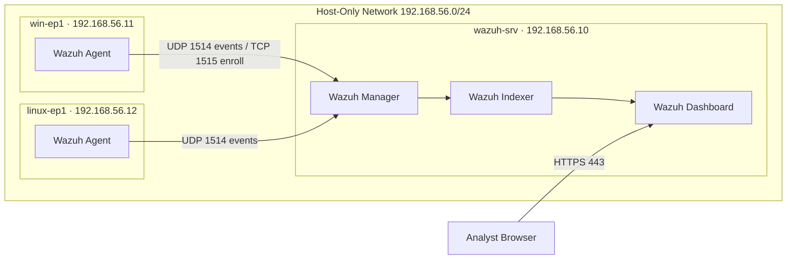

# Lab Architecture

The entire lab runs on a single workstation using VirtualBox, on an isolated host-only network so nothing touches the real network.

## VM Specifications

| VM | Role | OS | vCPU | RAM | Disk | IP |
|---|---|---|---|---|---|---|
| `wazuh-srv` | Wazuh SIEM (Docker) | Ubuntu Server 26.04 LTS | 4 | 8 GB | 50 GB | 192.168.56.10 |
| `win-ep1` | Windows endpoint | Windows 11 Enterprise Eval | 2 | 4 GB | 64 GB | 192.168.56.11 |
| `linux-ep1` | Linux endpoint | Ubuntu Server 26.04 LTS | 1 | 1 GB | 15 GB | 192.168.56.12 |

Each VM has two network adapters: **NAT** (Adapter 1, for internet/package downloads) and **Host-only** (Adapter 2, the isolated `192.168.56.0/24` lab network where agents talk to the manager). Host-only DHCP is disabled and every host is assigned a static IP.

## Data Flow

1. Agents on `win-ep1` and `linux-ep1` collect telemetry (system logs today; Sysmon event channel added in Phase 2).
2. Agents forward events to the Wazuh **Manager** over UDP 1514; enrollment happens over TCP 1515.
3. The Manager evaluates events against its ruleset, generates alerts, and Filebeat ships them to the **Indexer** (OpenSearch).
4. The **Dashboard** reads from the Indexer and is served over HTTPS 443 to the analyst's browser.

## Notes

- The Windows 11 VM requires EFI, Secure Boot, and a TPM 2.0 chip enabled in VirtualBox — all configurable in VirtualBox 7.x.
- This is a single-node Wazuh deployment, which is appropriate for a lab. A production deployment would separate the indexer into its own cluster for performance and redundancy.
